## Notifications Android O


---

- Picture-in-Picture mode 
- Autofill framework 
- Downloadable fonts 
- Fonts in XML 
- Autosizing TextView 
- Adaptive icons 

+++

- Color management 
- New WebView APIs 
- Pinning shortcuts and widgets 
- Maximum screen aspect ratio 
- Multi-display support 
- Notifications 

---
### Notifications

+++

```kotlin
NotificationCompat.Builder(context, notificationChannel)
    .setContentTitle("Notification Title")
    .setSmallIcon(android.R.drawable.sym_def_app_icon)
    .setContentText("Hello World!").build()
```

```kotlin
var notificationChannel2 = NotificationChannel(
        CHANNEL_ID,
        "Notification Channel",
        NotificationManager.IMPORTANCE_DEFAULT
)

mNotificationManager.createNotificationChannel(notificationChannel2)
```

```kotlin
mNotificationManager.notify((111, notification)
```

---
## What is new in Notifications? 
- Snoozing
- Settings
- Timeout
- Dismissal Listener
- Background colors
- Historic Messages
- Channels

---
### Snoozing

+++
#### Cal Marting

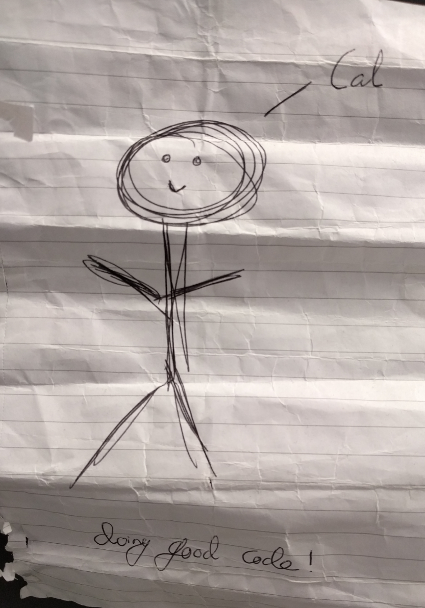

#### GitHub
https://github.com/cal2195

Doing good code! 
Of course Kotlin!
+++


+++
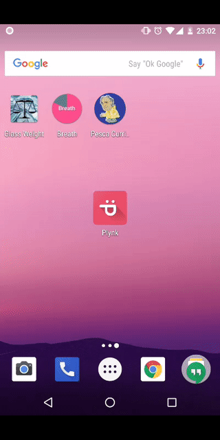

---
### Notification settings
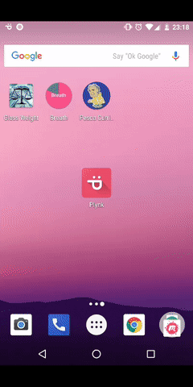

---
### Notification timeouts
```kotlin
    val mBuilder = NotificationCompat.Builder(context, CHANNEL_ID)
        .setSmallIcon(R.drawable.ic_action_icon)
        .setContentTitle(title)
        .setContentText(message)
        .setTimeoutAfter(5_000)              
```

@[5]

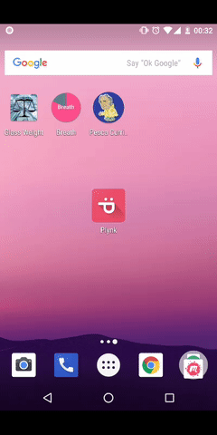

---
### Notification dismissal listener

```kotlin
class NotificationListener : NotificationListenerService() {

    override fun onNotificationRemoved(sbn: StatusBarNotification?, rankingMap: RankingMap?) {
    }

    override fun onNotificationRemoved(sbn: StatusBarNotification?, rankingMap: RankingMap?, reason: Int) {
    }
}
```
@[3-4]
@[6-7]

---
### Background colors

```kotlin
    return Notification.Builder(context, notificationChannel)
        .setContentTitle("Notification title")
        .setSmallIcon(android.R.drawable.sym_def_app_icon)
        .setContentText("Notification text")
        .setColorized(true)
        .setColor(Color.RED)
        .setOngoing(true)
        .build()
```

@[5-6]

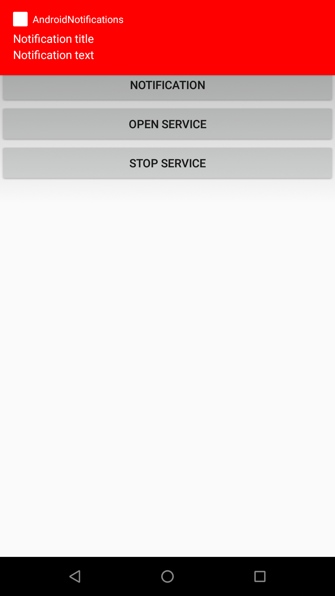
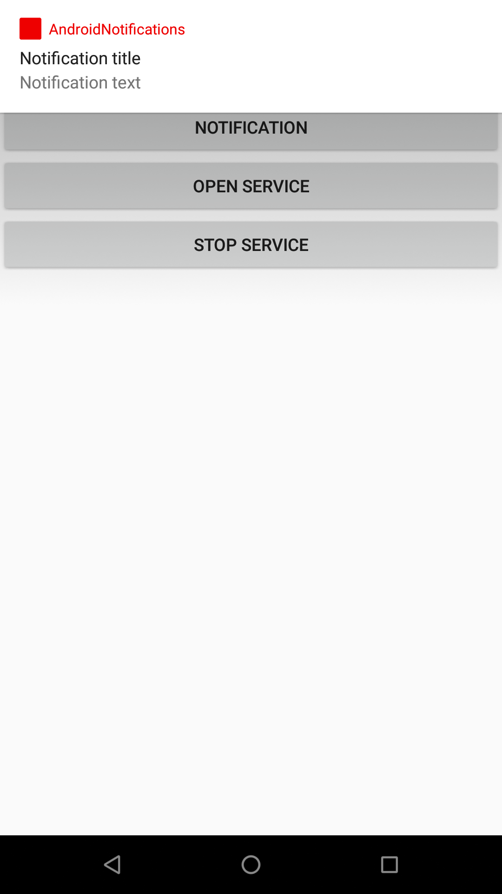

Note:
This is only for Foreground service notification

---
### Historic Messages in Messaging style

```kotlin
    return Notification.Builder(context, notificationChannel)
        .setContentTitle("Notification")
        .setSmallIcon(android.R.drawable.sym_def_app_icon)
        .setContentText("Notification MessagingStyle")
        .setStyle(Notification.MessagingStyle("Me")
                .setConversationTitle("Team lunch")
                .addMessage("What's up?", 3, "Coworker")
                .addMessage("Not much", 4, null)
                .addHistoricMessage(Notification.MessagingStyle.Message("Historic Message - not visible", 5, null))
                .addMessage("How about lunch?", 6, "Coworker"))
        .build()
```
@[7-8,10]
@[9]

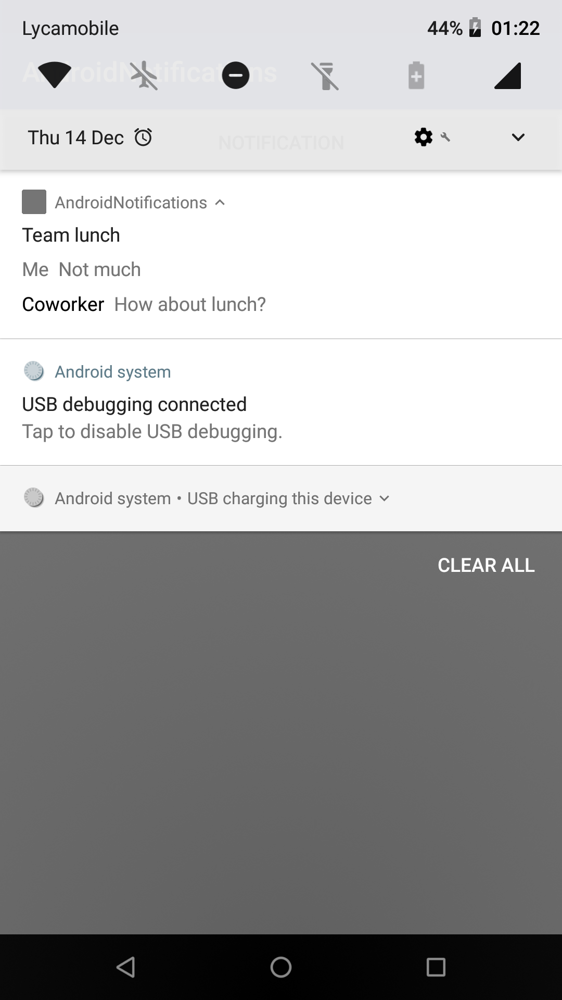

---
### Notification Channels

+++

```kotlin    
    var notificationChannel = NotificationChannel(
            CHANNEL_ID,
            "Notification Channel 1",
            NotificationManager.IMPORTANCE_HIGH
    )
    
    notificationChannel.lightColor = Color.RED
    notificationChannel.enableLights(true)
    notificationChannel.vibrationPattern = longArrayOf(0, 100, 500, 100, 500, 100, 500, 100, 500, 100)
    notificationChannel.enableVibration(true) // Not needed
    notificationChannel.setShowBadge(true)
    notificationChannel.lockscreenVisibility = Notification.VISIBILITY_PUBLIC
    notificationChannel.setSound(plynkSound, audioAttributes)
    notificationChannel.setBypassDnd(true)
    notificationChannel.group = GROUP_1

    mNotificationManager.createNotificationChannel(notificationChannel)
    
    simple_notification_button.setOnClickListener {
        val notification = NotificationFactory.newSimpleNotification(this, CHANNEL_ID)
        mNotificationManager.notify(1234, notification)
    }
    
    fun newSimpleNotification(context: Context, notificationChannel: String): Notification {
        return NotificationCompat.Builder(context, notificationChannel)
                .setContentTitle("Notification Title")
                .setSmallIcon(android.R.drawable.sym_def_app_icon)
                .setContentText("Hello World!").build()
    }        
```
@[1-5]
@[7-8]
@[9-10]
@[11]
@[12]
@[13]
@[14]
@[15]
@[17]
@[19-22]
@[24-29]
@[25]

Note:
Vibration pattern is (wait, buzz, wait, buzz, etc..)
NotificatonBuilder without Channel wont work in API 26+
Groups is just for visibility

+++
### Channel

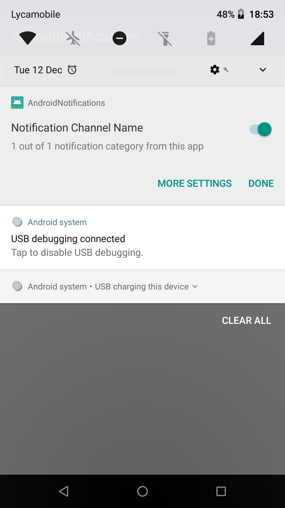
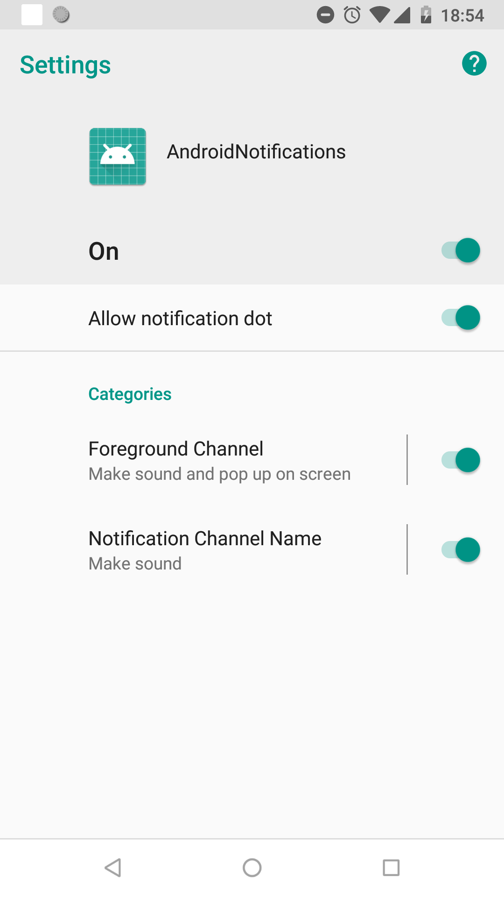
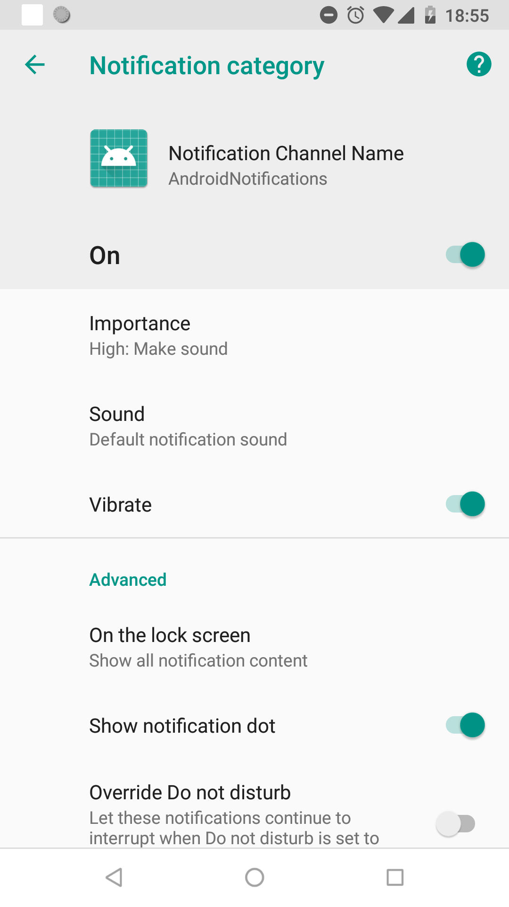

+++
### Importance

```java
    /*
     * A notification with no importance: does not show in the shade.
     */
    public static final int IMPORTANCE_NONE = 0;

    /*
     * Min notification importance: only shows in the shade, below the fold.
     */
    public static final int IMPORTANCE_MIN = 1;

    /*
     * Low notification importance: shows everywhere, but is not intrusive.
     */
    public static final int IMPORTANCE_LOW = 2;

    /*
     * Default notification importance: shows everywhere, makes noise, but does not visually
     * intrude.
     */
    public static final int IMPORTANCE_DEFAULT = 3;

    /*
     * Higher notification importance: shows everywhere, makes noise and peeks. May use full screen
     * intents.
     */
    public static final int IMPORTANCE_HIGH = 4;
```
Note:
PRIORITY_DEFAULT,PRIORITY_LOW,PRIORITY_MIN,PRIORITY_HIGH,PRIORITY_MAX
Now deprecated and replaced by Importance

+++
### Channel Groups
```kotlin

  mNotificationManager.createNotificationChannelGroup(NotificationChannelGroup(GROUP_1, "Group 1"))

  mNotificationManager.createNotificationChannelGroup(NotificationChannelGroup(GROUP_2, "Group 2"))


```

+++
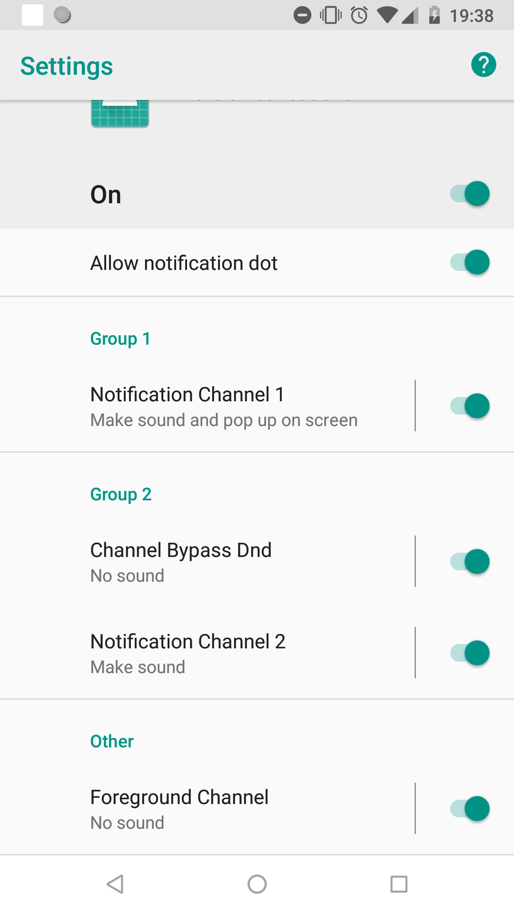

+++
### Notification Visibility
```java
    /*
     * Notification visibility: Show this notification in its entirety on all lockscreens.
     */
    public static final int VISIBILITY_PUBLIC = 1;

    /*
     * Notification visibility: Show this notification on all lockscreens, but conceal sensitive or
     * private information on secure lockscreens.
     */
    public static final int VISIBILITY_PRIVATE = 0;

    /*
     * Notification visibility: Do not reveal any part of this notification on a secure lockscreen.
     */
    public static final int VISIBILITY_SECRET = -1;
```

+++
### Modifiable?
```java
    /*
     * Sets whether notification posted to this channel should vibrate. The vibration pattern can
     * be set with {@link #setVibrationPattern(long[])}.
     *
     * Only modifiable before the channel is submitted to
     * {@link NotificationManager#notify(String, int, Notification)}.
     */
    public void enableVibration(boolean vibration) {
        this.mVibrationEnabled = vibration;
    }
```
@[5]

+++
### Delete a notification channel

```kotlin
 mNotificationManager.deleteNotificationChannel(CHANNEL_ID)
```

+++
### What if the user change it?
```kotlin
    val channel = mNotificationManager.getNotificationChannel(CHANNEL_ID)
    
    if (channel.importance != NotificationManager.IMPORTANCE_HIGH)
            
    private fun goToNotificationChannelSettings(channel: String) {
        val i = Intent(Settings.ACTION_CHANNEL_NOTIFICATION_SETTINGS)
        i.putExtra(Settings.EXTRA_APP_PACKAGE, packageName)
        i.putExtra(Settings.EXTRA_CHANNEL_ID, channel)
        startActivity(i)
    }
```

@[1]
@[3]
@[5-10]

---

## Recap

+++
### Notification Manager to create groups and channels (and delete it)

```kotlin
    private val mNotificationManager: NotificationManager by lazy {
        getSystemService(Context.NOTIFICATION_SERVICE) as NotificationManager
    }
```

```kotlin

        mNotificationManager.createNotificationChannelGroup(NotificationChannelGroup(GROUP_1, "Group 1"))

        mNotificationManager.createNotificationChannel(notificationChannel)

        val channel = mNotificationManager.getNotificationChannel(CHANNEL_ID)

        mNotificationManager.deleteNotificationChannel(CHANNEL_ID)

        mNotificationManager.notify(1234, notification)
        
```

@[2]
@[4]
@[5]
@[8]
@[10]

+++
### Notification Channel for settings

```kotlin
    var notificationChannel = NotificationChannel(
            CHANNEL_ID,
            "Notification Channel 1",
            NotificationManager.IMPORTANCE_HIGH
    )
    
    notificationChannel.lightColor = Color.RED
    notificationChannel.enableLights(true)
    notificationChannel.vibrationPattern = longArrayOf(0, 100, 500, 100, 500, 100, 500, 100, 500, 100)
    notificationChannel.enableVibration(true) // Not needed
    notificationChannel.setShowBadge(true)
    notificationChannel.lockscreenVisibility = Notification.VISIBILITY_PUBLIC
    notificationChannel.setSound(plynkSound, audioAttributes)
    notificationChannel.setBypassDnd(true)
    notificationChannel.group = GROUP_1
```

+++
### Notification Builder for texts and icons
```kotlin
    NotificationCompat.Builder(context, notificationChannel)
        .setContentTitle("Notification Title")
        .setSmallIcon(android.R.drawable.sym_def_app_icon)
        .setContentText("Hello World!")
        .build()
```
---
## Thanks!


### Code

https://github.com/josealfonsomora/AndroidNotifications

https://github.com/googlesamples/android-NotificationChannels/tree/master/kotlinApp

### Slides

gitpitch.com/josealfonsomora/AndroidNotifications/master

### CodeLab

https://codelabs.developers.google.com/codelabs/notification-channels-kotlin/

