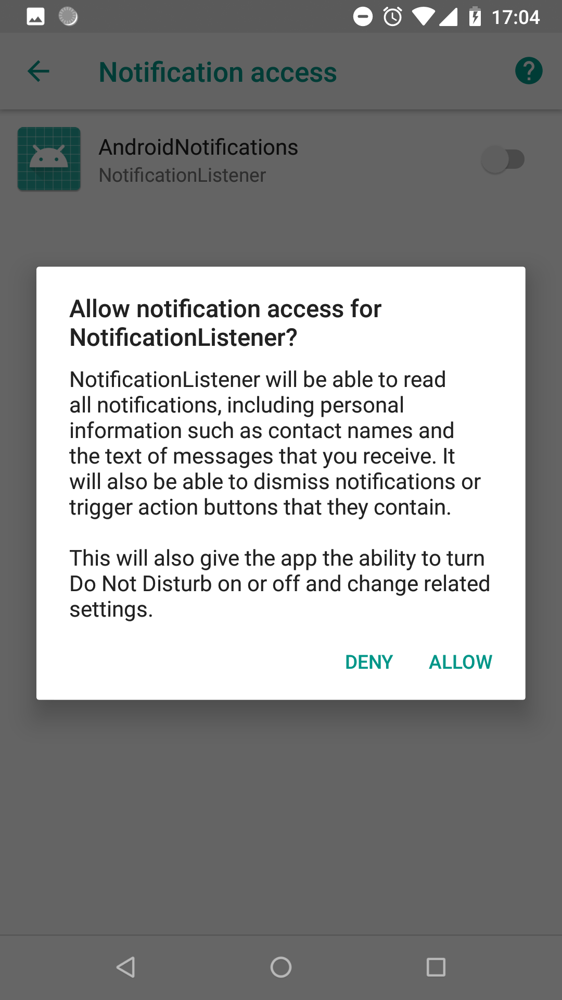

## Notifications Android O


---

- Picture-in-Picture mode 
- Autofill framework 
- Downloadable fonts 
- Fonts in XML 
- Autosizing TextView 
- Adaptive icons 

+++

- Color management 
- New WebView APIs 
- Pinning shortcuts and widgets 
- Maximum screen aspect ratio 
- Multi-display support 
- Notifications 

---
### Notifications

---
## What is new in Notifications? 
- Snoozing
- Notification timeouts
- Notification settings
- Notification dismissal
- Background colors
- Notification dots
- Messaging style
- Notification Channels

---
### Snoozing


---
### Notification timeouts
```kotlin
val mBuilder = NotificationCompat.Builder(context, CHANNEL_ID)
                .setSmallIcon(R.drawable.ic_action_icon)
                .setContentTitle(title)
                .setContentText(message)
                .setTimeoutAfter(5_000)              
```

@[5]


---
### Notification settings


---
### Notification dismissal

```kotlin
class NotificationListener : NotificationListenerService() {

    override fun onNotificationRemoved(sbn: StatusBarNotification?) {
    }

    override fun onNotificationRemoved(sbn: StatusBarNotification?, rankingMap: RankingMap?) {
    }

    override fun onNotificationRemoved(sbn: StatusBarNotification?, rankingMap: RankingMap?, reason: Int) {
    }
}
```
@[9-10]

+++



---
### Background colors

---
### Notification dots

---
### Messaging style

---
### Notification Channels