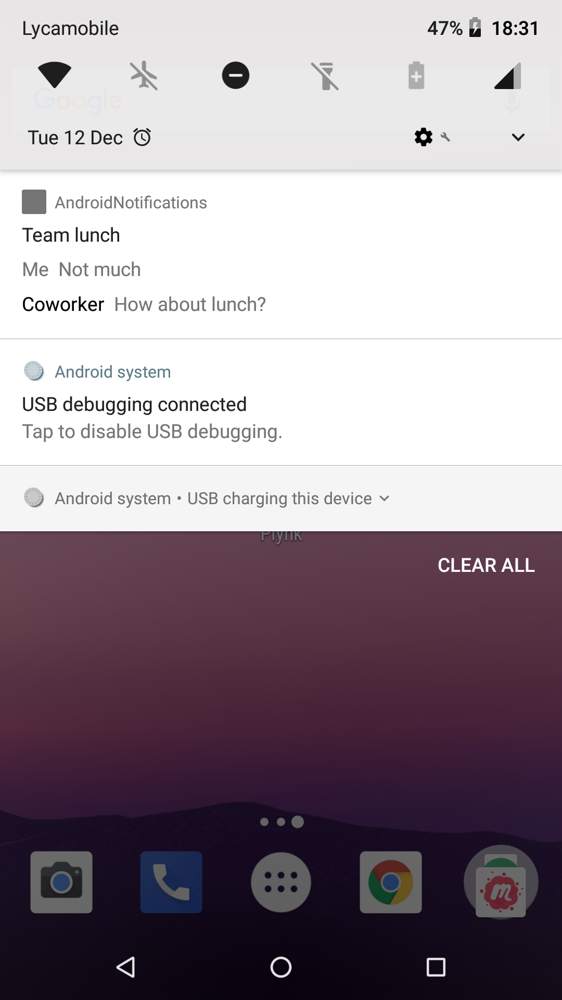

## Notifications Android O


---

- Picture-in-Picture mode 
- Autofill framework 
- Downloadable fonts 
- Fonts in XML 
- Autosizing TextView 
- Adaptive icons 

+++

- Color management 
- New WebView APIs 
- Pinning shortcuts and widgets 
- Maximum screen aspect ratio 
- Multi-display support 
- Notifications 

---
### Notifications

---
## What is new in Notifications? 
- Snoozing
- Settings
- Timeout
- Dismissal Listener
- Background colors
- Historic Messages
- Channels

---
### Snoozing


---
### Notification settings


---
### Notification timeouts
```kotlin
val mBuilder = NotificationCompat.Builder(context, CHANNEL_ID)
    .setSmallIcon(R.drawable.ic_action_icon)
    .setContentTitle(title)
    .setContentText(message)
    .setTimeoutAfter(5_000)              
```

@[5]


---
### Notification dismissal listener

```kotlin
class NotificationListener : NotificationListenerService() {

    override fun onNotificationRemoved(sbn: StatusBarNotification?) {
    }

    override fun onNotificationRemoved(sbn: StatusBarNotification?, rankingMap: RankingMap?) {
    }

    override fun onNotificationRemoved(sbn: StatusBarNotification?, rankingMap: RankingMap?, reason: Int) {
    }
}
```
@[9-10]

---
### Background colors

```kotlin
return Notification.Builder(context, notificationChannel)
    .setContentTitle("Notification title")
    .setSmallIcon(android.R.drawable.sym_def_app_icon)
    .setContentText("Notification text")
    .setColorized(true)
    .setColor(Color.RED)
    .setOngoing(true)
    .build()
```

@[5-6]


---
### Historic Messages in Messaging style

```kotlin
return Notification.Builder(context, notificationChannel)
    .setContentTitle("Notification")
    .setSmallIcon(android.R.drawable.sym_def_app_icon)
    .setContentText("Notification MessagingStyle")
    .setStyle(Notification.MessagingStyle("Me")
            .setConversationTitle("Team lunch")
            .addMessage("What's up?", 3, "Coworker")
            .addMessage("Not much", 4, null)
            .addHistoricMessage(Notification.MessagingStyle.Message("Historic Message - not visible", 5, null))
            .addMessage("How about lunch?", 6, "Coworker"))
    .build()
```
@[7-9]
@[10]



---
### Notification Channels

```kotlin
private val mNotificationManager: NotificationManager by lazy {
    getSystemService(Context.NOTIFICATION_SERVICE) as NotificationManager
}
    
var notificationChannel = NotificationChannel(
        CHANNEL_ID,
        "Notification Channel Name",
        NotificationManager.IMPORTANCE_DEFAULT
)

notificationChannel.lightColor = Color.RED
notificationChannel.vibrationPattern = longArrayOf(0, 100, 500, 100, 500, 100, 500, 100, 500, 100)
notificationChannel.setShowBadge(true)

mNotificationManager.createNotificationChannel(notificationChannel)
```


---
## Thanks!

### Links
https://developer.android.com/about/versions/oreo/android-8.0.html#notifications
